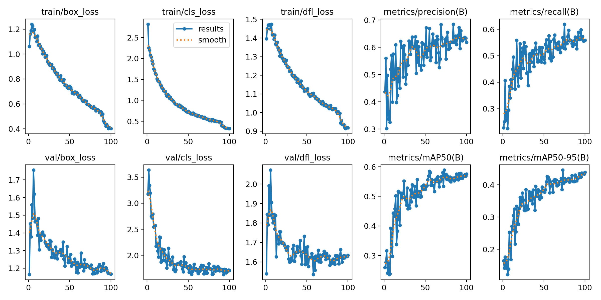

# 🚗 Vehicle Detection using YOLOv8

## 📖 Overview
This project implements **real-time vehicle detection and counting** using the **YOLOv8** deep learning model.  
It can detect various types of vehicles (cars, trucks, buses, motorcycles, etc.) from videos, images, or live camera streams.  
The system is designed for **traffic monitoring**, **vehicle counting**, and **automated analytics**.

## ✨ Features
- 🔍 **Vehicle detection** using YOLOv8  
- 📹 **Real-time processing** from webcam or video file  
- 🔢 **Vehicle counting** with dynamic tracking  
- 📈 **Training and evaluation** visualization (confusion matrix, PR/F1 curves)  
- 🧠 **Customizable models and datasets**  
- ⚙️ **Modular codebase** for easy extension and integration  

---

## 🗂️ Project Structure
```
VehicleDetection/
├── data/                     # Dataset and label files
│   ├── images/
│   └── labels/
├── models/
│   ├── yolov8/               # YOLOv8 pretrained weights
│   └── ckpt.t7
├── runs/                     # Training results and visualizations
│   └── detect/
│       ├── train/
│       └── train2/
├── src/
│   ├── detection/
│   │   └── yolov8_detector.py
│   ├── tracking/
│   │   ├── tracker.py
│   │   ├── verify.py
│   │   └── download_model.py
│   ├── counting.py
│   ├── real_time_counting.py
│   ├── data_loading.py
│   └── utils.py
├── config.py
├── main.py                   # Main entry point
├── requirements.txt
└── README.md
```

---

## ⚙️ Installation

### 1️⃣ Clone the Repository
```bash
git clone https://github.com/<bulbulelif>/VehicleDetection.git
cd VehicleDetection
```

### 2️⃣ Create a Virtual Environment
```bash
python -m venv venv
source venv/bin/activate       # Linux / macOS
venv\Scripts\activate        # Windows
```

### 3️⃣ Install Dependencies
```bash
pip install -r requirements.txt
```

---

## 🚀 Usage

### ▶️ Run the Detection
To detect and count vehicles from a webcam:
```bash
python src/real_time_counting.py
```

To run detection on a video file:
```bash
python main.py --source path/to/video.mp4
```

### ⚙️ Optional Parameters
- `--source`: Path to video file or `0` for webcam input  
- `--model`: Path to YOLOv8 weights (default: `models/yolov8/yolov8n.pt`)  
- `--conf`: Confidence threshold (default: 0.5)  
- `--save`: Save annotated output video  

---

## 🧠 Model Training (Optional)
If you want to retrain YOLOv8 on a custom dataset:
```bash
yolo detect train data=data.yaml model=yolov8n.pt epochs=50 imgsz=640
```
Trained weights will be saved under `runs/detect/train/weights/`.

---

## 🧩 Technologies Used
- **Python 3.8+**
- **Ultralytics YOLOv8**
- **OpenCV**
- **NumPy**
- **Matplotlib**

---

## 📊 Results
Sample detection results and performance metrics are available in `runs/detect/train/`.

| Metric | Value |
|:-------|:------|
| Precision | High |
| Recall | High |
| FPS | Real-time (depends on GPU) |

Example detection visualization:  


---

## 🤝 Contributing
Contributions are welcome!  
To contribute:
1. Fork the repository  
2. Create a new branch (`git checkout -b feature/my-feature`)  
3. Commit your changes (`git commit -m "Add new feature"`)  
4. Push to your branch (`git push origin feature/my-feature`)  
5. Open a Pull Request  

---

## 📜 License
This project is licensed under the [MIT License](LICENSE).  
You are free to use, modify, and distribute it for any purpose.
